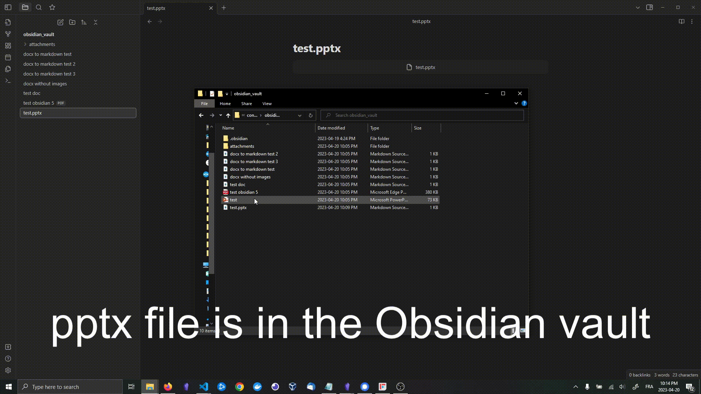

# Docx notes to obsidian

Batch import your old large note folders into your obsidian vault, keep the same folder structure and converts `.docx|.doc` to markdown while doing so !

## Features 
- Batch converts folders and import them straight into your obsidian vault, recursively or not, with media placed in your attachment folder
- Supports `.docx|.doc` import with conversion to markdown, but it can also import pdf or other files as well (wihtout conversion) to keep your folder structure
- Converts multimarkdown image format to obsidian image format (`![[image.png]]`)
- Supports Headings (Word headings 1-5 will be converted to markdown headings 1-5)
- Supports for lists, tables, images, font alteration (underline, bold & italic) as well as maths, in latex format.
- Doesn't alter the integrity of your old folders, simply copies your files and deletes the artefacts created (media folders and docx converted from doc).

## How it works :
The script walks through the folder provided (recursively, or not)
1) If a file is a `.doc`, it will convert it to docx (with LibreOffice) and continue...
2) If a file is a `.docx`, it will 
   a) Convert it to markdown (with Pandoc) and copy it to the exact relative path in your obsidian vault.
   b) If there were images extracted (to a media folder, by pandoc), it will rename them to a UUID, convert them to png (if `emf` or `wmf`) and replace the multimarkdown link format (``) to an obsidian image format (`![[1234-1234-1234.png]]`)
   c) It will convert some more multimarkdown format to obsidian flavoured markdown
3) If a file is something else, it will copy it to the same relative path in your obsidian vault, only if the `--additional_files` argument specifies it.
4) It then deletes all media folders created by pandoc and all `.docx` files converted from `.doc` in step 2 (original `.doc` files are untouched !)

## Requirements

1) You must have [Pandoc](https://pandoc.org/installing.html). We use Pandoc to convert from docx to .md
2) You must have [LibreOffice](https://www.libreoffice.org/download/download-libreoffice/). We use LibreOffice to convert `doc` to `docx` and `emf/wmf` to `png`
3) You must install python requirements : 
```bash
python -m pip install -r requirements.txt 
```
## Test
I'd suggest to make a test run before, to make sure the settings are good, requirements installed and to test on a few samples of your own files.

### Recursive Test (input directory and its subdirectories)
Files copied from input_test folder and subfolders to obsidian_vault folder. Images stored in obsidian_vault/attachments. PDF and xlsx are also copied.
```bash
python converter.py ./input_test ./obsidian_vault/attachments ./obsidian_vault --additional_files .xslx,.pdf -r
```

### Non-Recursive Test (input directory only)
Files copied from input_test folder and subfolders to obsidian_vault folder. Images stored in obsidian_vault/attachments. Docx files only.
```bash
python converter.py ./input_test ./obsidian_vault/attachments ./obsidian_vault 
```

## Run 
The run command looks like this :
```bash
python converter.py <path-to-input> <path-to-obsidian-attachment> <path-to-obsidian-output> 
```

Additional tags include : 
```bash
# If you want to add recursivity
- r 

# If you don't have LibreOffice installed in the default path (C:\Program Files\LibreOffice\program\soffice.exe)
--libreoffice <path-to-soffice.exe>

# If you want the script to also copy other files (without any conversion) while going through the folders
--additional_files .pdf,.xlsx # A comma separated list of extensions (with '.' before); Or
--additional_files all        # 'all' will copy all other files

# If you want to convert all powerpoints (.pptx|.ppt) to a PDF before copying it (NOTE: you have to add '.pptx,.ppt' or 'all' to the `--additional_files` argument) 
-p

# If you want to copy your other files without converting them to pdf, but still want to access it through obsidian, you can use the linked_files feature
# Read more about the link feature in the 'Linked markdown explained' part down below
--linked_files .pptx,.xlsx # Will link only pptx and xlsx
--linked_files all         # Will link all files (pdf included)

```

## Linked markdown explained
Obsidian cannot open xlsx or pptx files, but it can create a markdown file with a link that looks like this :
```

```
Doing so will create a visual button that, when clicked, will open the default app for this file. 
See for yourself :



## Speeds
Speeds depends on a lot of factor, but from my tests, what takes the most time is the conversion from .emf to .png.

## Helping 
I used this script to import many docx into my obsidian vault and was able to fix a few errors i've encountered, but if you notice new errors OR would like to add more modifications after the conversion, open an issue or a PR :)

## Roadmap
Next ideas I wanna implement are :
- [x] recursive file import.
- [x] Make it work with .doc files
- [x] Add possibility to convert PowerPoints to pdf before importing in obsidian
- [x] Add possibility to link unsupported files in obsidian (Creating a new .md file and adding  in it)
- [x] Better unicode support for filenames (replace #, % characters and switch utf-16)
